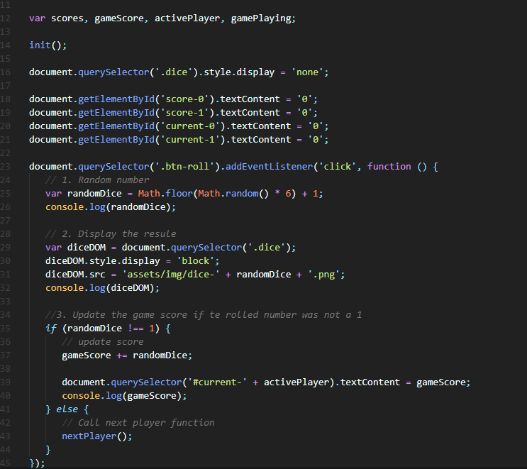
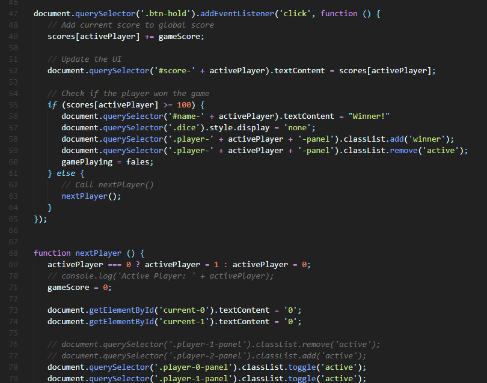
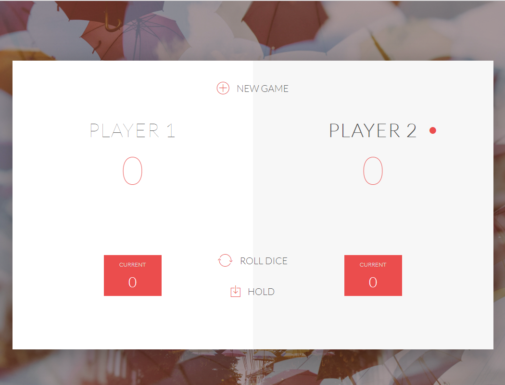
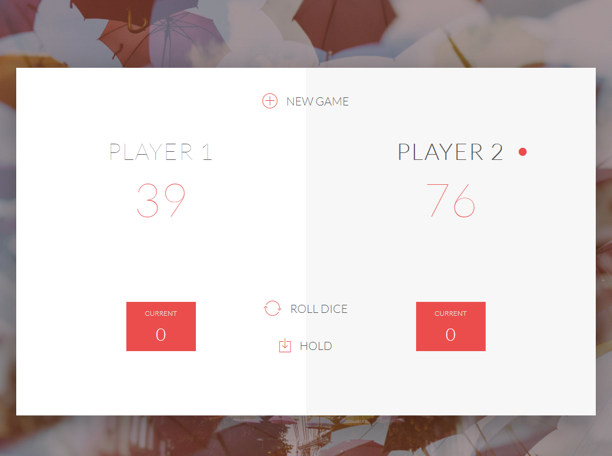
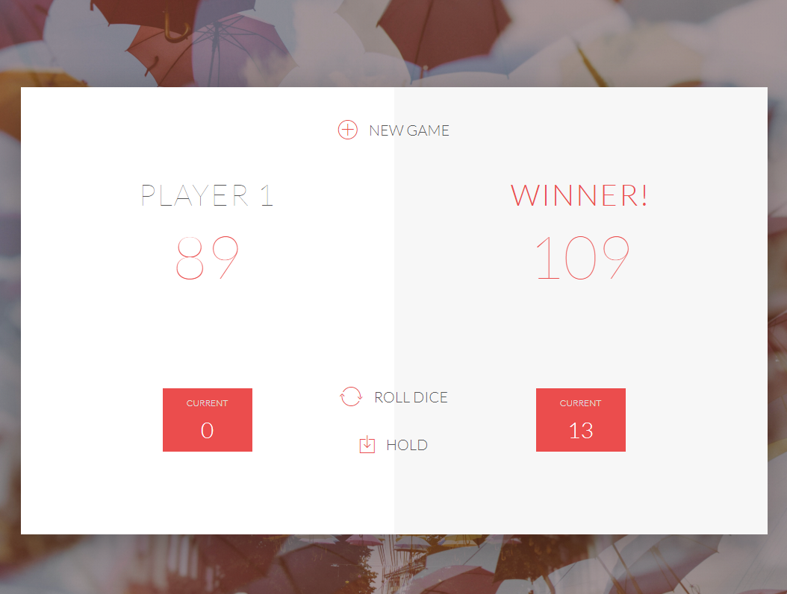

# ROLL THE DICE GAME
## JavaScript assignment - The objective is to create a roll the dice game app in HTML, CSS and Javascript.

## Start the game here
[Click to start](https://monksedo.github.io/RollTheDiceGame/)
## GAME RULES:

- The game has 2 players, playing in rounds
- In each turn, a player rolls a dice as many times as he/she whishes. Each result  get added to his/her ROUND score
- BUT, if the player rolls a 1, all his ROUND score gets lost. After that, it's the next player's turn
- The player can choose to 'Hold', which means that his ROUND score gets added to his GLOBAL score. After that, it's the next player's turn
- The first player to reach 100 points on GLOBAL score wins the game

## Technology Used
HTML, CSS, and Javascript

## New JavaScript Verion
[View New Version](assets/js/dicegameNew.js)

## Earlier JavaScript Code Implementation
[View Code](assets/js/dicegame.js)
### Code Snippet

### Code Snippet

### Game Start Screen Shots

### Score

### Winner

